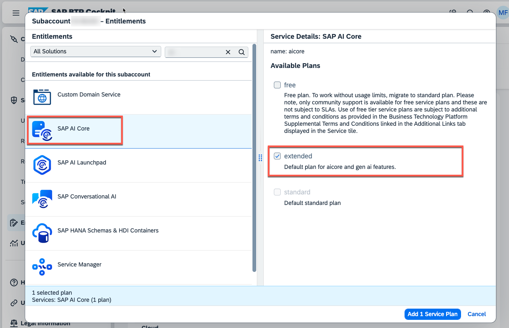
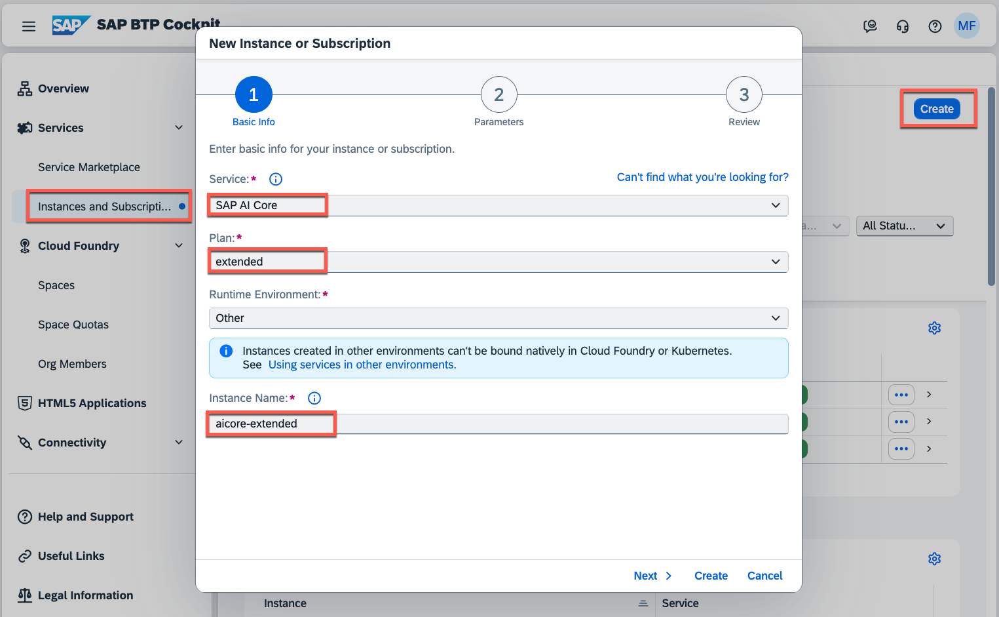
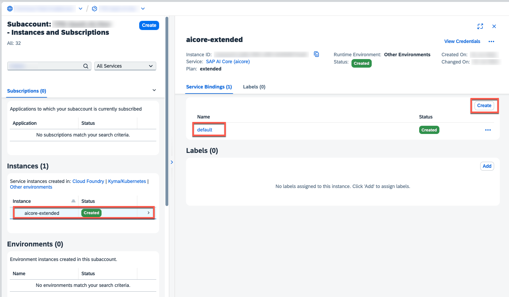
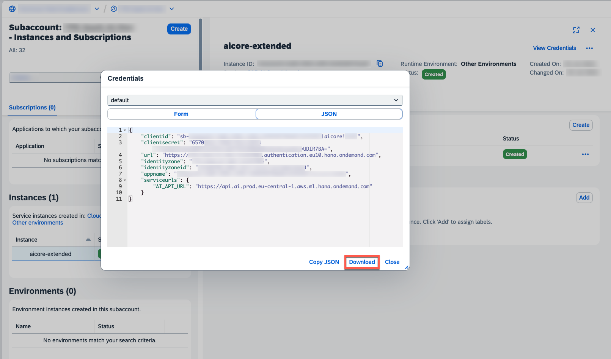
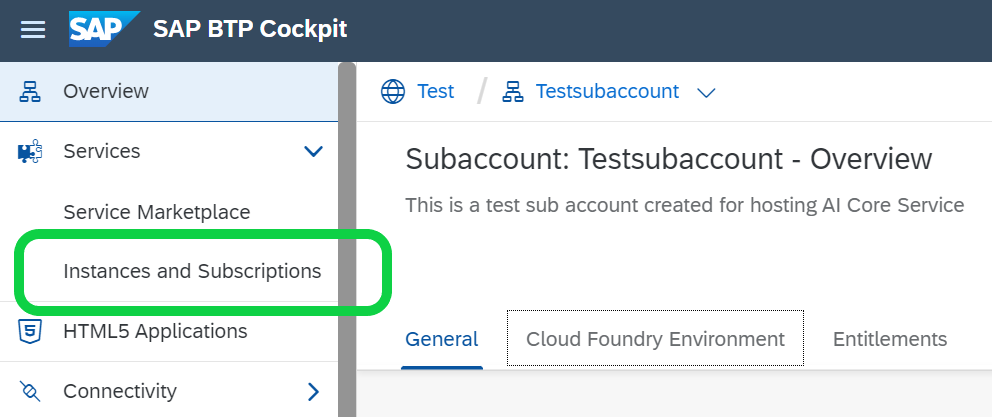
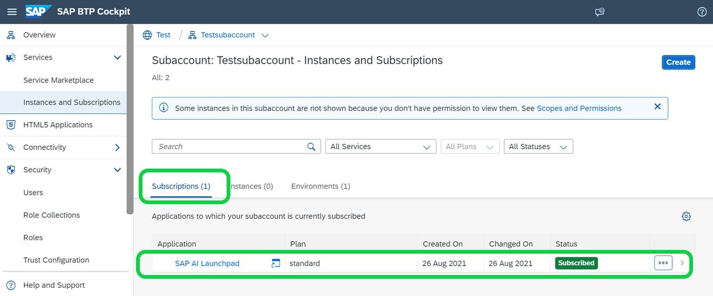
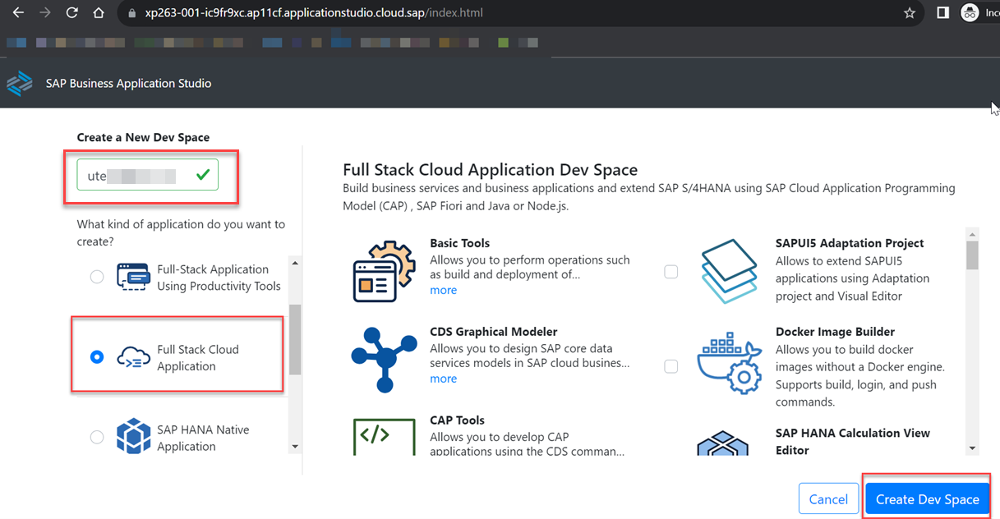
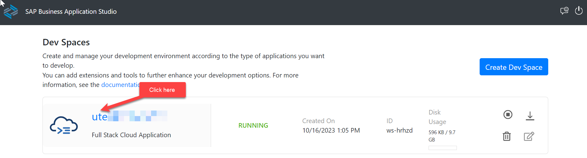
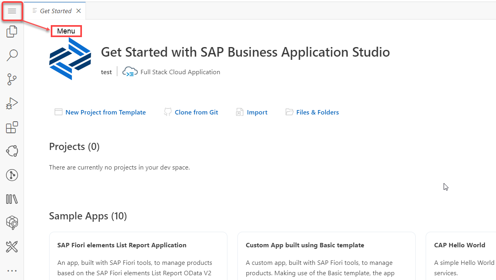
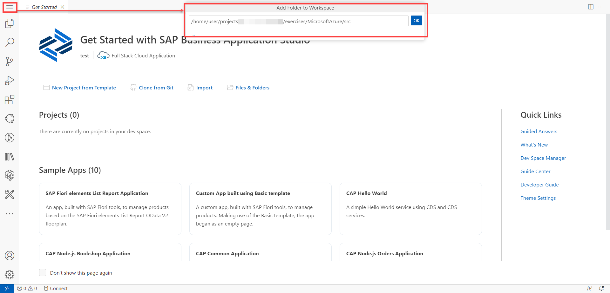

# EXERCISE 1. Reference Architecture of an SAP BTP CAP Application using LLMs on Microsoft Azure OpenAI via SAP Generative AI Hub

> Note: If you are using the infrastructure provide by our team, then you can skip the Sections 1,2 and directly 
move to [Section 3](#section-3---setting-up-your-development-environment)

# Section 1 - BTP Entitlements

SAP BTP Entitlements required for executing this usecase

1. SAP AI Core (Plan : Extended)
2. SAP AI Launchpad
3. SAP BTP, Cloud Foundry Runtime (Memory : 2 GB)
4. SAP Business Application Studio
5. SAP HANA Cloud (Plan - hana)
6. SAP HANA Schemas & HDI Containers (Plan : hdi-shared)

# Section 2 - Subscriptions

## Section 2.1 - Setup Business Application Studio

Follow the [Business Application Studio](https://help.sap.com/docs/bas/sap-business-application-studio/subscribe-to-sap-business-application-studio) tutorial to subscribe to SAP Business Application Studio and add necessary authorizations and roles.

## Section 2.2 - Setup the Generative AI hub in SAP AI Core

The generative AI hub incorporates large language models (LLMs) into your AI activities in SAP AI Core and
SAP AI Launchpad. LLMs are self-supervised, deep learning models that have been trained on vast amounts of unlabeled data. They leverage AI technology and industrial-scale computational resources to learn complex language patterns
and semantic knowledge bases for natural language processing (NLP) tasks. They parse input, such as prompts, and by predicting a target word, can return contextually relevant responses written in natural
language. A single LLM can perform multiple NLP tasks by using different input formats and output modes. LLMs are general models but can be fine-tuned with additional embeddings for specialized or domain-specific use cases.
SAP AI Core and the generative AI hub help you to integrate LLMs and AI into new business processes in a cost-efficient manner.

1. Please ensure you assigned the following entitlement to your subaccount.

  - **SAP AI Core** - extended

    [](./images/GAH_CreateInstance00.png?raw=true)

2. In your subaccount, please create a new service instance for the SAP AI Core **extended** service entitlement. 

    > **Hint** - In our scenario we are using the **Other** environment type, as we are consuming the SAP AI Core APIs via a dedicated destination. Alternatively, you can also use the **Cloud Foundry** or **Kyma** environment and **bind** the service instance. 

    [](./images/GAH_CreateInstance01.png?raw=true)

3. Create a new **Service Binding** for the SAP AI Core **extended** service instance, which will be used by our sample application. 

    [](./images/GAH_CreateInstance02.png?raw=true)

4. Download the generated Service Binding details or copy the values for your reference(This credentials will be used in [Exercise 1.4](../ex1.4/README.md).

    [](./images/GAH_CreateInstance03.png?raw=true)


## Section 2.3 - Subscribe to AI Launchpad

1. Subscribe to SAP AI Launchpad by following the [Subscribe to AI Launchpad](https://help.sap.com/docs/ai-launchpad/sap-ai-launchpad/subscribe-to-sap-ai-launchpad) documentation.

2. Add the roles by following the [AI Launchpad Roles](https://help.sap.com/docs/ai-launchpad/sap-ai-launchpad/allow-access-to-sap-ai-launchpad) documentation.

3. In the BTP subaccount, choose Instances and Subscriptions

    

4. On the Subscriptions tab, click the link for SAP AI Launchpad to launch SAP AI Launchpad application.

    

5. Click on Workspaces and add connection to your AI Core instance by following [Add Connections](https://help.sap.com/docs/ai-launchpad/sap-ai-launchpad/add-connection-to-sap-ai-core) tutorial.

6. Create a resource group by following [Create Resource Group](https://help.sap.com/docs/ai-launchpad/sap-ai-launchpad/create-resource-group) documentation. Note down the resource group name and you will use this in [Exercise 1.4](../ex1.4/README.md).

7. Follow the [Generative-AI](https://developers.sap.com/tutorials/ai-core-generative-ai.html) tutorial and perform the steps 1 to 3. Optionally you can also do the next steps mentioned in the above tutorial to understand the Generative AI Hub features.

## Section 2.4 - Set Up SAP HANA Cloud Instance

Refer [SAP HANA Cloud](https://developers.sap.com/tutorials/hana-cloud-deploying.html) tutorial to create an instance of SAP HANA Cloud in SAP BTP.

If you already have an existing HANA Instance, you can map it to your SAP BTP subaccount.

# Section 3 - Setting up your development environment

1. Login into your SAP BTP subaccount. Click the **Instance and Subscriptions** on the left menu, and then click the **Go to Application** button of the SAP Business Application Studio service subscription.

    

2. Create a Dev Space.

    

3. When it’s ready, open your dev space by clicking on the name. 

    


4. In the menu in SAP Business Application Studio, select **Terminal** &rarr; **New Terminal**.
  
    

   Navigate to the projects folder by typing below in the terminal:

   ```bash
   cd projects
   ```

7. Clone the SAP CAP Application from the GitHub repository. 

   ```bash
   git clone https://github.tools.sap/I055867/sustainability-co2-genai.git
   ```

8. Click **Menu->File** and then choose **Add Folder to Workspace** from the dropdown menu. Open the project by choosing/typing the below then clicking **Open**:
    ```bash
    /home/user/projects/sustainability-co2-genai/exercises/MicrosoftAzure/src
    ```

    
    
Continue to - [Exercise 2: API CAP Deployment ](../ex1.2/README.md) where you will deploy the backend API of the Smart CO2 Converter App.
